# Chapter 1 - Introduction (Pages 1-4)
Pattern Recognition is concerned with the automatic discovery of regularitites in a set of data using algorithims. These regularaties are then used to take action, such as classification. In a supervised learning approach, a training set is established. A training set is a series of labeled data that the computer uses to tune a Machine Learning (ML) model. This data is passed into a function that is determined during the training, or learning phase. After this learning phase, a subset of data that are not used in the training set, known as the testing set, validation set, or hold-out set, are evaluated in the system to analyze how well the model generalizes the data. Generalization is how well the system is able to identify data it has not seen before. Often times the data is pre-processed to ensure that the training samples are of similar structure. In the example of MNIST the images of digits are resized to ensure that every digit fits within certain bounds. This is to make the learning process easier for the algorithim in use. This pre-processing step is also known as Feature Extraction. This is particularly useful when the original data is large, such as a video stream being used for facial recognition. The preprocessing stage can help narrow down a smaller subreigon to speed up the processing stage, as there are less pixels to analyze, this narrowing of parameters is known as Dimesnionality Reduction. Care must be taken however, as it is possible that useful information can be discarded which can degrade the performance of the algorithim. 

If your desired output consists of more than one variable, it is known as Regression. This type of learning that relies on the use of labeled data is known as Supervised Learning. The process of analyzing data into similar groups is known as Classification. A unsupervised learning approach, takes in unlabeled data with the hope of discovering groups of data that are similar to one another, also known as clustering. It can also be used to determine this distrubution of data across the input space, which is knwon as Density Estimation. Visualiztion techniques can also be employed to project high-dimesnional data into 2 or 3 dimensions, which is a lot easier for humans to make sense of. A third type of learning is known as Reinforcment Learning, where to goal of the system is to maximize a reward, based on a series of actions to take. This type of system is not taught how to maximize that reward, but uses those actions to achieve it. This type of learning is best suited for teaching a computer how to play a game. The goal is to maximize the final score, but the computer learns on its own how to accomplish that. The algorithim in use attempts to learn how different moves will affect the ending score, this is known as Credit Assignment. Reinforcement learning is a fine balance between exploration, or the discovery of new ways to maximize that score, and exploitation the repetition of an action to maximize a score. 

## 1.1 Polynomial Curve Fitting (Pages 4-12)
This is effectively an attempt at finding the line of best fit between a dataset, without fitting the dataset exactly. If you were to draw a curve fitting the dataset exactly, this is known as Overfitting, and while it may seem feasible, it performs quite poorly on new samples of the dataset. The careful consideration of how to make this curve, is known as model comparison or model selection. Generally speaking, using a polynomial function. Suppose we plot a series of points upon some line, with each point straying stochastically (randomly) from this line. Our end goal is to determine how these points relate to one another, and a way we can do this is by fitting the data. We use a polynomial function, because it allows our line of best fit to take the form of a curve to fit these points. If we were using a linear function, this curve would not be possible, and fitting this data would be extremly difficult if not impossible. We fit this model by determining the error of the curve created by the function, compared to a new point which has not been graphed yet. We minimizie this error by using an error function, a common example of one of these functions is calculating the squares of errors between predictions, or using the Root Mean Square formula. 

## 1.2 Probability Theory (Pages 12-17)
Often times pattern recognition deals with a lot of uncertainty, this can take the form of noisy data sets or a finite number of samples in that dataset. Probabilty theory is a framework to deal with the quantification and maniuplation of this uncertainity.  Suppose we have two boxes each containing fruit. Box 1 (red) contains 2 apples and 6 oranges, while box two (blue) contians 3 apples and 1 orange. Lets assume that the liklihood of choosing each box is 40/60. This means the probability is 4/10 or .4 for box 1 and 6/10 or .6 for box 2. (Note: Probabilty should always fall between the interval of 0 and 1). We can express this as

    p(B = r) = 4/10 which can be re-written as p(r)
    p(B = b) = 6/10 which can be re-written as p(b)

    where p is the probability, B is the box, r is box 1, and b is box 2 

Now suppose we want to answer something a bit more complicated, such as what is the probability of picking a apple from box 1 or a orange from box 2. To answer these questions two basic rules of probability need to be examined. The sum rule is essentially saying the probability of X and Y which is known as a joint probability. The product rule states the probability of Y given X, which is a conditional probability.  

Sum Rule
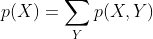

Product Rule

Together, these rules come together to create Bayes Theorem, which plays a vital role in the world of machine learning and pattern recogintion. 

Bayes Theorem
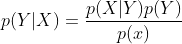

Using these mathematical rules, we can begin to answer some of our previous questions. Suppose we randomly pick a box and want to determine the probability of pulling a apple or a orange.
We can express this as the probability of f (the fruiy) given b (the box).

    p(F = a | B = r) = 2/8 or 1/4
    p(F = o | B = r) = 6/8 or 3/4
    p(F = a | B = b) = 3/4
    p(F = o | B = b) = 1/4

Using these probabilities and the sum and product rule, we are able to determine the probability of choosing an apple regardless of which box we choose. 

    p(F=a) = p(F=a|B=r)p(B=r) + p(F=a|B=b)p(B=b)
    p(F=a) = 1/4 * 4/10 + 3/4 * 6/10
    p(F=a) = 4/40 + 18/40
    p(F=a) = 22/40 or 11/20

Now lets try something a little bit more complicated. Lets assume we pull a orange, but we want to know what box it came from. To solve this problem, we need to analyze the probability distrubition. Lets start by determining what the probability of pulling a orange out of the red box.

    p(B=r|F=o) = p(F=o|B=r)p(B=r) / p(F=o)
    p(B=r|F=o) = 3/4 * 4/10 * 20/9
    p(B=r|F=o) = 240 / 360 or 2/3

Given that the probability of pulling a orange out of the red box is 2/3, we can infer that the probability of pulling a orange out of the blue box is then equal to 1/3 as probabilities must always summate to 1. If we were not told what frut was choosen, the probability of the box can be reffered to as the prior probability since we dont know what identity we are trying to determine. When we are then asked to determine the probability of the orange, we can call that the posterior probability, since we now know what indentity we are trying to solve for. 

### 1.2.1 Probability Densities (Pages 17-19)
Probability Density states that if variable x falls between a given interval it is the probability density over x.
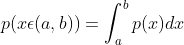

Due to the fact that probabilites are non-negative and x must exist in a real axis, a probability density must be greater than or equal to zero and the integral of p(x)dx between negative infinity and positive inifinity is equal to 1.

### 1.2.2 Expectations and Covariances (Pages 19 and 20)
An important concept related to operations related to probability, is finding the weighted averages of those functions. This average value of the function, is called the expectation of the function, which is denoted by E[f]. In the case of discrete variables, the average is weighted by the probabilities of the different values of x. In the case of continuous variables, expectations are expressed in terms of integration to the corresponding formula for probability density.

Discrete Expectation
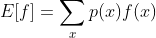

Continuous Expectation
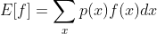

In both cases if we have N points, the expectation is approximated over a series of finite points, as shown in the formula below. Note that this approximation becomes more exact as N approaches infinity. 

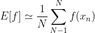

When considering the expectation of a variable in a function with multiple variables, a subscript attached to E will be used to denote which variable is being averaged. Expectations can also be calculated for a variable given a condition, also known as a conditional expectation. 

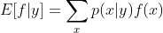

Variance is a term to describe how variablity there is around the mean value.

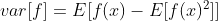

Covariance is a measure of how much variablity there is around the mean value, as x and y vary together. If these values are independent from one another, than this covariance vanishes completely. 

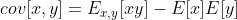

If variables x and y are vectors, the covariance for them is a matrix. In the notation given below, T represents a Transposition of the vector.

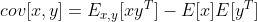

### 1.2.3 Bayesian Probabilites (Pages 21-24)
So far we have been analyzing probability in terms of the frequency of random, repeatable events, this is the classical or frequentist approach to probability. We will now examine things in terms of Bayesian probability, which is more concerned with providing quantitative values to represent uncertainty. If we examine Bayes Theorem as shown above, we can begin to make sense of how uncertainty can be measure. The p(x|y) is really a function of the vector y where x represents the dataset. Variable/vector y can be considered the liklihood function, or how probable the dataset is given the variable y. The denominator or p(x) is the normalization constant, which ensures that the probability density integrates out to 1.

While the approaches between bayes and frequentist have been similar thus far they operate in differnt ways. For example in the frequentist method, y is considered a fixed parameter, which is determined by an estimator. Often times this estimator is the maximum liklihood, in which y is a value that maximizes the liklihood function of p(x|y). The negaitve log of this liklihood function is thought of as the error function, because maximizing the liklihood is the same as minimizing error. One approach is to determine error is to use the bootstrap. Suppose we have a dataset of N points, we can create new datasets by subsampling values from the original dataset. We can repeat this process M times, or until every permutation of the dataset has been calculated. We can then examine the accuracy of parameter estimates, by looking at the variablity of predictions across these bootstrap sets.

Where a bayesian approach differs is that x represents a single fixed dataset, and the uncertainty is described as a probability distrubition over y. This offers and advantage as prior knowledge arises naturally. Consider if we toss a fair coin 3 times, and it lands heads all 3 times. Using the frequentist approach, we may conclude that the probability of getting a head is 1, however we know this is incorrect as tails is still certainly possible. Bayesian approaches, lead to much less extreme conclusions. However, a common criticism of this approach is that Bayesian approaches can give scores of high confidence, even if the actual results remain poor. This is why the frequentist approach untilizes other techniques such as cross-validation. 

### 1.2.4 Gaussian Distribution
The Guassian or Normal Distrubution, is a important concept related to Machine Learning and Pattern Recognition, for any single real-valued variable x, where mu represents the mean, and sigma represents the variance. The square root of variance is also known as the Standard Deviation, and the reciprocal of variance (1/sigma^2) is called the precision.

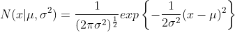

## 1.3 Model Selection

## 1.4 The Curse of Dimensionality

## 1.5 Decision Theory

## 1.6 Information Theory

## Lecture Notes
A pattern is something that repeatedly appears exactly, or similarlly inside a larger group. A pattern is not something that is random. There are two main paths for recoginizing patterns. 1, Trying to find all all possible patterns in the dataset and categorize them into meaningful ways. 2, use we use datasets both labeled or unlabeled, and use statistical models to then categorize or cluster the data into similar groups.

Types of Learning:
* Supervised Learning -  The use of labeled data, to teach the algorithim on how to complete a task. An example of this is classification which is used to output discrete categories. Regression on the other hand, outputs continuous variables. 
  * In supervised learning we have a training set, where every input sample has some sort of label, associated with it. That label is also called a target vector. 

  * A testing set is also used, which is a subset of the training set which is used to evaluate the performance or accuracy of the learning algorithim.

  * The overall goal is to generalize the learning, so it can be tested on a set, and perform well on samples that are not part of that training set. In other words we try and classify something that the computer has not encountered before. 

  * Cross Validation is a big part of supervised learning. We train the algorithim on a subset of the data, and train on that subset. We repeat this process for the series of subset from the main dataset, and compare the overall results of each training step. Often times each training sample is just one sample. We do this in order to maximize the amount of data present. You never want to reuse the same data sample twice though, if you do you run the risk of adding bias into the data. 

  * Examples: 
    * MNIST Digit Classification - The process of taking handwritten digits and categorize them based on the features present in each image. For example we know the number 4 can be open or closed, which can make it less obvious as to which number it is. So in order to account for this, you would need input samples of both open and closed. 

    * Fitting a Curve Between Points (Regression) - The best way to determine this fit is to use a polynomial function. A polynomial function allows, the line to fit as a curve. When using a polynomial function the end goal is to minimize the error, or maximize the accuracy. The error is the difference between the location of the point, versus the value of the formula being used. In the polynomial function, x represents our data points. We calculate the error by using the formula for the sum of squares. After calculating the error, we average out the error using the root mean square error. To minimize this error, we take the derivative. (Continued on page 76 of lecture slides.) If our model fits too much or overfits, we lose generalization as it learns the testing set exactly. Basically the larger the dataset the more complicated the model we can use. A general rule of thumb is the number of data points should be 5-10 times the number of parameters or degrees of freedom the model the model has to learn from. 

* Unsupervised Learning - Uses unknown or unlabeled data, and the algorithim draws its own conclusions on how the data is related to one another. Examples of this are cluster, density estimation, and visualization. 

* Reinforcement Learning - The algorithim figures out how to complete a task, while trying to maximize some score. So instead of classifying data, the goal is to deploy actions to complete some objective. This is not a major part of this book or this course. However it is very useful for applications like teaching a computer to play a game, drive a car, or with robotics. 